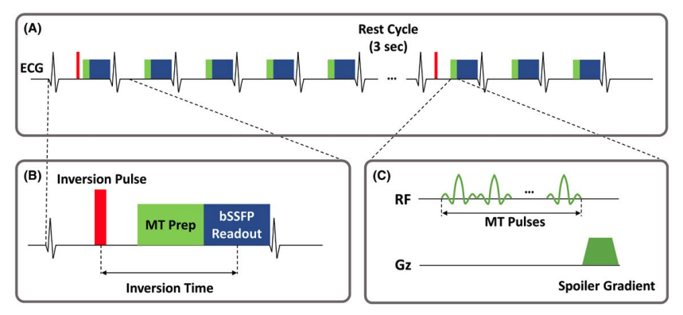

**[Fully Automated Mouse Echocardiography Analysis Using Deep Convolutional Neural Networks](https://journals.physiology.org/doi/abs/10.1152/ajpheart.00208.2022)**  
**Chong Duan**, Mary Kate Montgomery, Xian Chen, Soumya Ullas, John Stansfield, Kevin McElhanon, Dinesh Hirenallur-Shanthappa  
_American Journal of Physiology-Heart and Circulatory Physiology 323.4 (2022): H628-H639._
  
 
 

**[Bridge Segmentation Performance Gap Via Evolving Shape Prior](https://ieeexplore.ieee.org/abstract/document/9204618)**  
Chaoyu Chen, Xin Yang, Haoran Dou, Ruobing Huang, Xiaoqiong Huang, Xu Wang, **Chong Duan**, Shengli Li, Wufeng Xue, Pheng Ann Heng, Dong Ni  
_IEEE Access 8 (2020): 173961-173973._  
  
 
 

**[Automated Myocardial T2 and Extracellular Volume Quantification in Cardiac MRI Using Transfer Learning–based Myocardium Segmentation](https://pubs.rsna.org/doi/abs/10.1148/ryai.2019190034)**  
Yanjie Zhu, Ahmed S Fahmy, **Chong Duan**, Shiro Nakamori, Reza Nezafat  
_Radiology: Artificial Intelligence 2.1 (2020): e190034._  
  
 
 

**[Non‐contrast myocardial infarct scar assessment using a hybrid native T1 and magnetization transfer imaging sequence at 1.5 T](https://onlinelibrary.wiley.com/doi/abs/10.1002/mrm.27636)**  
**Chong Duan**, Yanjie Zhu, Jihye Jang, Jennifer Rodriguez, Ulf Neisius, Ahmed S. Fahmy, Reza Nezafat  
_Magnetic resonance in medicine 81, no. 5 (2019): 3192-3201._ [[GitHub](https://github.com/chongduan/HYTOM)]  
  
 
 

**[Integrated motion correction and dictionary learning for free‐breathing myocardial T1 mapping](https://onlinelibrary.wiley.com/doi/abs/10.1002/mrm.27579)**  
Zhu, Yanjie, Jinkyu Kang, **Chong Duan**, Maryam Nezafat, Ulf Neisius, Jihye Jang, Reza Nezafat    
_Magnetic resonance in medicine 81, no. 4 (2019): 2644-2654._  
  
 
 

**[Cardiovascular magnetic resonance feature tracking strain analysis for discrimination between hypertensive heart disease and hypertrophic cardiomyopathy](https://journals.plos.org/plosone/article?id=10.1371/journal.pone.0221061)**  
Neisius, Ulf, Lana Myerson, Ahmed S. Fahmy, Shiro Nakamori, Hossam El-Rewaidy, Gargi Joshi, **Chong Duan**, Warren J. Manning, Reza Nezafat    
_PloS one 14, no. 8 (2019)._  
  
 
 

**[Late effects of radiation prime the brain microenvironment for accelerated tumor growth](https://www.redjournal.org/article/S0360-3016(18)33639-3/fulltext)**  
**Duan, Chong**, Ruimeng Yang, Liya Yuan, John A. Engelbach, Christina I. Tsien, Keith M. Rich, Sonika M. Dahiya, Tanner M. Johanns, Joseph JH Ackerman, Joel R. Garbow  
_International Journal of Radiation Oncology* Biology* Physics 103, no. 1 (2019): 190-194._  
  
 
 

**[Inhibitors of HIF-1α and CXCR4 mitigate the development of radiation necrosis in mouse brain](https://www.redjournal.org/article/S0360-3016(17)34478-4/abstract)**  
Yang, Ruimeng, **Chong Duan**, Liya Yuan, John A. Engelbach, Christina I. Tsien, Scott C. Beeman, Carlos J. Perez-Torres, Xia Ge, Kieth M. Rich, Joseph JH Ackerman, Joel R. Garbow  
_International Journal of Radiation Oncology* Biology* Physics 100, no. 4 (2018): 1016-1025._  
  
 
 

**[Modeling dynamic contrast-enhanced MRI data with a constrained local AIF](https://link.springer.com/article/10.1007%2Fs11307-017-1090-x)**  
**Duan, Chong**, Jesper F. Kallehauge, Carlos J. Pérez-Torres, G. Larry Bretthorst, Scott C. Beeman, Kari Tanderup, Joseph JH Ackerman, Joel R. Garbow  
_Molecular Imaging and Biology 20, no. 1 (2018): 150-159._  
  
 
 

**[Bayesian Modeling of NMR Data: Quantifying Longitudinal Relaxation in Vivo, and in Vitro with a Tissue-Water-Relaxation Mimic (Crosslinked Bovine Serum Albumin)](https://link.springer.com/article/10.1007%2Fs00723-017-0964-z)**  
Meinerz, Kelsey, Scott C. Beeman, **Chong Duan**, G. Larry Bretthorst, Joel R. Garbow, Joseph JH Ackerman  
_Applied magnetic resonance 49, no. 1 (2018): 3-24._  
  
 
 

**[Effect of off-resonance on T1 saturation recovery measurement in inhomogeneous fields](https://www.sciencedirect.com/science/article/pii/S1090780717301271)**  
**Duan, Chong**, Colm Ryan, Shin Utsuzawa, Yi-Qiao Song, Martin D. Hürlimann  
_Journal of Magnetic Resonance 281 (2017): 31-43._  
  
 
 

**[Can anti-vascular endothelial growth factor antibody reverse radiation necrosis? A preclinical investigation](https://link.springer.com/article/10.1007%2Fs11060-017-2410-3)**  
**Duan, Chong**, Carlos J. Perez-Torres, Liya Yuan, John A. Engelbach, Scott C. Beeman, Christina I. Tsien, Keith M. Rich, Robert E. Schmidt, Joseph JH Ackerman, Joel R. Garbow  
_Journal of neuro-oncology 133, no. 1 (2017): 9-16._  
  
 
 

**[Are complex DCE‐MRI models supported by clinical data?](https://onlinelibrary.wiley.com/doi/abs/10.1002/mrm.26189)**  
**Duan, Chong**, Jesper F. Kallehauge, G. Larry Bretthorst, Kari Tanderup, Joseph JH Ackerman, Joel R. Garbow    
_Magnetic resonance in medicine 77, no. 3 (2017): 1329-1339._  
  
 
 

**[Hyperthermic laser ablation of recurrent glioblastoma leads to temporary disruption of the peritumoral blood brain barrier](https://journals.plos.org/plosone/article?id=10.1371/journal.pone.0148613)**  
Leuthardt, Eric C., **Chong Duan**, Michael J. Kim, Jian L. Campian, Albert H. Kim, Michelle M. Miller-Thomas, Joshua S. Shimony, David D. Tran.  
_PLoS One 11, no. 2 (2016): e0148613._  
  
 
 

**[Renal DCE-MRI model selection using bayesian probability theory](https://www.ncbi.nlm.nih.gov/pmc/articles/PMC6024409/)**  
Beeman, Scott C., Patrick Osei-Owusu, Chong Duan, John Engelbach, G. Larry Bretthorst, Joseph JH Ackerman, Kendall J. Blumer, Joel R. Garbow.  
_Tomography 1, no. 1 (2015): 61._  
  
 
 

**[Tracer kinetic model selection for dynamic contrast-enhanced magnetic resonance imaging of locally advanced cervical cancer](https://www.tandfonline.com/doi/full/10.3109/0284186X.2014.937879)**  
Kallehauge, Jesper Folsted, Kari Tanderup, **Chong Duan**, Søren Haack, Erik Morre Pedersen, Jacob Christian Lindegaard, Lars Ulrik Fokdal, Sandy Mohamed Ismail Mohamed, Thomas Nielsen  
_Acta Oncologica 53, no. 8 (2014): 1064-1072._  

 
 

**[Phosphane‐Catalyzed [4+ 1] Annulation between Nitroalkenes and Morita–Baylis–Hillman Carbonates: Facile Synthesis of Isoxazoline N‐Oxides by Phosphorus Ylides](https://onlinelibrary.wiley.com/doi/abs/10.1002/asia.201301633)**  
Zhou, Rong, **Chong Duan**, Changjiang Yang, Zhengjie He  
_Chemistry–An Asian Journal 9, no. 4 (2014): 1183-1189._
 
 

**[Phosphine-triggered tandem annulation between Morita–Baylis–Hillman carbonates and dinucleophiles: Facile syntheses of oxazepanes, thiazepanes, and diazepanes](https://pubs.acs.org/doi/abs/10.1021/ol302696e)**  
Zhou, Rong, Jianfang Wang, **Chong Duan**, Zhengjie He   
_Organic letters 14, no. 24 (2012): 6134-6137._  
